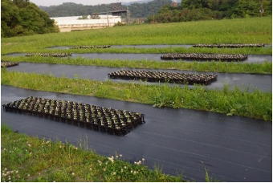

# Contact

[[English]](index.html) [[Japanese]](index_jp.html)  

## Current address
Department of Evolutionary Biology and Environmental Studies, University of Zurich  
Winterthurerstrasse 190, 8057 Zurich, Switzerland  
Tel: +41-44-635-4986; Office: Y13-J-68 ([Evolutionary and Ecological Genomics Group](https://www.ieu.uzh.ch/en/research/evolbiol/ecogenomics.html))  
E-mail: yasuhiro.sato"at"uzh.ch; yassato36c"at"outlook.com; sato.yasuhiro.36c"at"kyoto-u.jp  
ORCID: [0000-0002-6466-723X](http://orcid.org/0000-0002-6466-723X)  
[Google scholar citations](http://scholar.google.co.jp/citations?user=HbrGYr8AAAAJ&hl=en);
[ResearchGate](https://www.researchgate.net/profile/Yasuhiro_Sato3); [Publons](https://publons.com/researcher/450213/yasuhiro-sato)  

### News
See [Twitter@yassatojpn](https://twitter.com/search?q=%40yassatojpn&src=recent_search_click)
  
  
  
---

# Research

### **Quantitative Ecological Genetics of Species Interaction**  
I am interested in how genetic variation shapes, and is shaped by, species interactions. To analyze quantitative genetic variation in complex ecological traits, my research adopts cutting-edge tools from computational biology and functional genomics. Currently I am working on plant-herbivore interactions, but other projects involving species interaction are also welcome.  
**Keywords: Ecological genetics, Plant-insect interaction, Herbivory**  

## Recent projects

#### **1. Plant neighborhood effects and the maintenance of polymorphism**  
Herbivory risk depends on neighboring plants as well as plants’ own traits. Such neighbor effects can exert frequency-dependent selection on plant defense when they occur among plant genotypes within a species (reviewed by Sato 2018 Plant Species Biology). My PhD study showed that the feeding preference of a leaf beetle mediated negative frequency-dependent selection on the *GLABRA1*-based trichome dimorphism of *Arabidopsis halleri* (Sato & Kudoh 2017 The American Naturalist; Sato et al. 2017 Functional Ecology).

](./photo/psbi12186-toc-0001-m_coverphoto.jpg){width=50%}

#### **2. Quantitative genetics of plant neighborhood effects on herbivory**  
Plant neighborhood effects are not always attributable to a single trait or gene. To dissect the genetic architecture of neighbor effects, I have developed new methods, named "Neighbor GWAS" (Sato et al. 2021 Heredity) and "Neighbor QTL" (Sato et al. 2021 G3). These new methods are being applied to quantitative trait variation in insect herbivory and communities on *Arabidopsis thaliana* accessions.

{width=75%}
  
#### **3. Data analysis in ecology, evolution, and genetics**  
To untangle complex ecological interactions, my research often employ statistical tools. This experience enables me to not only develop new methods (Sato et al. 2022 bioRxiv) but also collaborate with other research areas (e.g., Nakadai et al. 2018 Oecologia; Shimizu-Inatsugi et al. 2021 Plant Species Biology; Takimoto & Sato et al. 2021 Ecological Informatics). Data from plant ecology and genomics are especially welcome to collaborate.  
  
  
  
---

# Achievements

*^†^Equal contribution; \*Correspondence*  

## Preprint
1. **Sato Y**\*, Takahashi Y, Xu C, Shimizu KK\*. (2022) Detecting frequency-dependent selection through the effects of genotype similarity on fitness components. **_bioRxiv_** <https://doi.org/10.1101/2022.08.10.502782>  

1. Stockenhuber R, Akiyama R, Tissot N, Yamazaki M, Wyler M, Arongaus AB, Podolec R, **Sato Y**, Milosavljevic S, Widmer A, Ulm R, Shimizu KK\*. (2021) The *UV RESISTANCE LOCUS 8*-mediated UV-B response is required alongside *CRYPTOCHROME1* for plant survival under sunlight in the field. **_bioRxiv_** <https://doi.org/10.1101/2021.12.08.471623>  

## Peer-reviewed articles
1. Takimoto H^†^\*, **Sato Y**^†^, Nagano AJ, Shimizu KK, Kanagawa A. (2021) Using a two-stage convolutional neural network to rapidly identify tiny herbivorous beetles in the field. **_Ecological Informatics_** 66:101466 <https://doi.org/10.1016/j.ecoinf.2021.101466>  

1. **Sato Y**, Yamamoto E, Shimizu KK\*, Nagano AJ\*. (2021) Neighbor GWAS: incorporating neighbor genotypic identity into genome-wide association studies of field herbivory. **_Heredity_** 126(4):597–614. <https://doi.org/10.1038/s41437-020-00401-w>  

1. **Sato Y**^†^\*, Takeda K^†^, Nagano AJ\*. (2021) Neighbor QTL: an interval mapping method for quantitative trait loci underlying plant neighborhood effects. **_G3; Genes|Genomes|Genetics_** 11(2):jkab017. <https://doi.org/10.1093/g3journal/jkab017>  

1. Shimizu-Inatsugi R\*, Milosavljevic S, Shimizu KK, Schaepman-Strub G, Tanoi K, **Sato Y.** (2021) Metal accumulation and its effect on leaf herbivory in an allopolyploid species _Arabidopsis kamchatica_ inherited from a diploid hyperaccumulator _A. halleri_. **_Plant Species Biology_** 36(2):208–217. <https://doi.org/10.1111/1442-1984.12304>  

1. **Sato Y**, Tezuka A, Kashima M, Deguchi A, Shimizu-Inatsugi R, Yamazaki M, Shimizu KK\*, Nagano AJ\*. (2019) Transcriptional variation in glucosinolate biosynthetic genes and inducible responses to aphid herbivory on field-grown _Arabidopsis thaliana_. **_Frontiers in Genetics_** 10:787. <https://doi.org/10.3389/fgene.2019.00787>  

1. **Sato Y**, Shimizu-Inatsugi R, Yamazaki M, Shimizu KK\*, Nagano AJ\*. (2019) Plant trichomes and a single gene _GLABRA1_ contribute to insect community composition on field-grown _Arabidopsis thaliana_. **_BMC Plant Biology_** 19:163. <https://doi.org/10.1186/s12870-019-1705-2>  

1. Nakadai R^†^\*, Hashimoto K^†^, Iwasaki T, **Sato Y.** (2018) Geographical co-occurrence of butterfly species: the importance of niche filtering by host plant species. **_Oecologia_** 186(4):995–1005. <https://doi.org/10.1007/s00442-018-4062-1>  

1. **Sato Y**^†^\*, Ito K^†^, Kudoh H. (2017) Optimal foraging by herbivores maintains polymorphism in defence in a natural plant population. **_Functional Ecology_** 31(12):2233-2243. <https://doi.org/10.1111/1365-2435.12937> [[postprint]](https://repository.kulib.kyoto-u.ac.jp/dspace/handle/2433/228143?locale=en)  

1. **Sato Y**\*, Kudoh H. (2017) Herbivore-mediated interaction promotes the maintenance of trichome dimorphism through negative frequency-dependent selection. **_The American Naturalist_** 190(3):E67-E77. <https://doi.org/10.1086/692603> [[PDF]](https://repository.kulib.kyoto-u.ac.jp/dspace/handle/2433/226924?locale=en)  

1. **Sato Y**\*, Kudoh H. (2017) Fine-scale frequency differentiation along a herbivory gradient in the trichome dimorphism of a wild _Arabidopsis_. **_Ecology and Evolution_** 7(7):2133-2141. <https://doi.org/10.1002/ece3.2830>  

1. **Sato Y**\*, Kudoh H. (2016) Presence of substitute diets alters plant resistance to specialist and generalist herbivores: a meta-analysis. **_Ecosphere_** 7(11):e01446 <https://doi.org/10.1002/ecs2.1446>  

1. **Sato Y**\*, Kudoh H. (2016) Associational effects against a leaf beetle mediate a minority advantage in defense and growth between hairy and glabrous plants. **_Evolutionary Ecology_** 30(1):137-154. <https://doi.org/10.1007/s10682-015-9809-0> [[postprint]](http://repository.kulib.kyoto-u.ac.jp/dspace/handle/2433/201635?locale=en)  

1. **Sato Y**\*, Sato S. (2015) Spring temperature predicts the long-term molting phenology of two cicadas, _Cryptotympana facialis_ and _Graptopsaltria nigrofuscata_ (Hemiptera: Cicadidae). **_Annals of the Entomological Society of America_** 108(4):494-500. <https://doi.org/10.1093/aesa/sav036> [[postprint]](http://repository.kulib.kyoto-u.ac.jp/dspace/handle/2433/201636?locale=en)  

1. **Sato Y**\*, Kudoh H. (2015) Tests of associational defence provided by hairy plants for glabrous plants of _Arabidopsis halleri_ subsp. _gemmifera_ against insect herbivores. **_Ecological Entomology_** 40(3):269-279. <https://doi.org/10.1111/een.12179> [[postprint]](http://repository.kulib.kyoto-u.ac.jp/dspace/handle/2433/201637?locale=en)  

1. **Sato Y**, Kudoh H\*. (2014) Fine-scale genetic differentiation of a temperate herb: relevance of local environments and demographic change. **_AoB PLANTS_** 6:plu070. <https://doi.org/10.1093/aobpla/plu070>  

1. **Sato Y**\*, Kawagoe T, Sawada Y, Hirai MY, Kudoh H. (2014) Frequency-dependent herbivory by a leaf beetle, _Phaedon brassicae_, on hairy and glabrous plants of _Arabidopsis halleri_ subsp. _gemmifera_. **_Evolutionary Ecology_** 28(3):545-559. <https://doi.org/10.1007/s10682-013-9686-3> [[postprint]](http://repository.kulib.kyoto-u.ac.jp/dspace/handle/2433/179616?locale=en)  

1. **Sato Y**\*, Kudoh H. (2013) Relative strength of phenotypic selection on the height and number of flowering-stalks in the rosette annual _Cardamine hirsuta_ (Brassicaceae). **_Journal of Ecology and Environment_** 36(3):151-158. <https://doi.org/10.5141/ecoenv.2013.151>  

1. **Sato Y**\*, Takakura KI, Nishida S, Nishida T. (2013) Dominant occurrence of cleistogamous flowers of _Lamium amplexicaule_ in relation to the nearby presence of an alien congener _L. purpureum_. **_ISRN Ecology_** Article ID:476862. <http://dx.doi.org/10.1155/2013/476862>  

## Peer-reviewed monographs/reviews
1. **Sato Y\*.** (2018) Associational effects and the maintenance of polymorphism in plant defense against herbivores: review and evidence. **_Plant Species Biology_** 33(2):91-108. <https://doi.org/10.1111/1442-1984.12201> [[postprint]](https://repository.kulib.kyoto-u.ac.jp/dspace/handle/2433/234646?locale=en)  

1. Sakata Y\*, **Sato Y.** (2017) Evolutionary ecology of plant defense: integrating different spatial scales within and among species (in Japanese). **_Japanese Journal of Ecology_** 67(3):287-306. <https://doi.org/10.18960/seitai.67.3_287>  
  
## Peer-reviewed conference proceedings
1.	Kuzuhara H, Takimoto H, **Sato Y**, Kanagawa A. (2020) Insect pest detection and identification method based on deep learning for realizing a pest control system. **_Proceedings of the Society of Instrument and Control Engineers (SICE) 2020 Annual Conference 2020_**. pp. 709–714. <https://doi.org/10.23919/SICE48898.2020.9240458>  
  
## Computer programs
1. **Sato Y**\*, Yamamoto E, Shimizu KK, Nagano AJ. (2021) ‘rNeighborGWAS’. R package available at the Comprehensive R Archive Network (CRAN), <https://cran.r-project.org/package=rNeighborGWAS>  

1. **Sato Y**\*, Takeda K, Nagano AJ. (2021) ‘rNeighborQTL’. R package available at CRAN, <https://cran.r-project.org/package=rNeighborQTL>  
  

## Conference contributions    
1. **Sato Y**, Takahashi Y, Xu C, Shimizu KK. Detecting frequency-dependent selection using a genetic marker regression of fitness components. In: S24 'Progress and Prospects in Adaptation Genomics'. **_The 2022 Congress of the European Society for Evolutionary Biology_**, Prague, Czech Republic (18 August 2022, reviewed talk)

1. **Sato Y**, Nagano AJ, Shimizu KK. Genomics of within-species mixed planting against insect herbivores. In: MON3-b 'From the species to the individual: investigating plant diversity on the scale that matters most' (organised by Drs. P. Villa and M.C. Schuman). **_World Biodiversity Forum 2022_**, Davos, Switzerland. (29 June 2022, reviewed talk). <https://www.worldbiodiversityforum.org/>

1. Kuzuhara H, Takimoto H, **Sato Y**, Kanagawa A. Insect pest detection and identification method based on deep learning for realizing a pest control system. **_The Society of Instrument and Control Engineers (SICE) Annual Conference 2020_**. Chiang Mai, Thailand [changed into an online meeting due to COVID-19] (25 September 2020, talk) 

1. **Sato Y**, Shimizu-Inatsugi R, Yamazaki M, Nagano AJ, Shimizu KK. Field GWAS of neighbor effects and its potential application to targeted polycultures in anti-herbivore defense. **_URPP Global Change and Biodiversity Conference_**, P15, Monte Verita, Ascona, Switzerland (June-July 2019, poster).

1. **Sato Y**. Using personal legacy data to reveal the molting phenology of Japanese cicadas. In: S19 'Ongoing Cicada Research in East Asia' (organised by Prof. J. Yikweon), **_The 8th EAFES International Congress_**, Nagoya, Japan (April 2018, invited talk).

1. **Sato Y**, Ito K, Kudoh H. Associational effects and the maintenance of trichome dimorphism in a wild *Arabidopsis*. **_The 2017 Congress of the European Society for Evolutionary Biology_**, S32-P08, Groningen, Netherlands (August 2017, poster).

1. **Sato Y**, Ito K. Modeling the effects of optimal foraging herbivores on the maintenance of trichome dimorphism in a wild *Arabidopsis* population. **_URPP Global Change and Biodiversity Conference_**, P28, Monte Verita, Ascona, Switzerland (August-September 2016, poster).

1. **Sato Y**, Kudoh H. Associational antiherbivore defense promotes the coexistence of hairy and glabrous plants. **_The 100th Annual Meeting of the Ecological Society of America_**, PS30-98, Baltimore, MD, USA (August 2015, poster).

1. **Sato Y**, Kudoh H. Associational anti-herbivore defence and the maintenance of hairy and glabrous plants in *Arabidopsis halleri* subsp. *gemmifera*. **_Bristol-Kyoto Plant Sciences Workshop_**, P-14, Bristol, UK (September 2014, poster).

1. **Sato Y**, Kudoh H. Factors responsible for plant resistance to a shared herbivore: a meta-analysis of herbivore responses between choice and no-choice conditions. **_International Symposium for "Biodiversity & Evolution" project of Excellent Graduate Schools_**, P-03, Kyoto, Japan (December 2013, poster).

1. **Sato Y**, Kawagoe T, Kudoh H. A test for frequency-dependent herbivory on two trichome morphs of *Arabidopsis halleri*. **_The 5th EAFES International Congress_**, P2-147A, Otsu, Japan (March 2012, poster).  

*And the other 35 contributions to academic conferences in Japanese (4 invited talks, 10 talks and 21 posters)*
  
  
---

# About me

*PDF version of my CV is available [here](./cv/CV_YasuhiroSato.pdf)*

### Yasuhiro Sato  
During my childhood, I collected nymphal shells of Japanese cicadas over ten years (Sato & Sato 2015). This early experience brought me to the field of ecology later in my life.
  
I obtained my bachelor, master, and doctoral degree at Kyoto University, Japan. I did my undergraduate study in 2011 at the Laboratory of Insect Ecology, and then completed PhD in 2016 at the Laboratory of Plant Molecular Ecology (Kudoh Group) of the Center for Ecological Research. This experience on entomology and botany made me interested in plant-insect interactions. 
  
After PhD degree, I experienced two postdoctoral positions at Ryukoku University, Japan, as an independent postdoctoral fellow of Japan Society for the Promotion of Science (JSPS) (from 2016 to 2017) and as a junior group leader of Precursory Research for Embryonic Science and Technology (PRESTO) program of the Japan Science and Technology Agency (JST) (from 2017 to 2021). I was hosted by the Laboratory of Information Biology (Nagano Group) for five years, through which I acquired my skills on plant bioinformatics and functional genomics.
  
During the first postdoc position, I started my collaboration with Ecological and Evolutionary Genomics Group (Shimizu Laboratory) at the University of Zurich, Switzerland, as an affiliated member of University Research Priority Program of Global Change and Biodiversity (URPP GCB). After the completion of JST PRESTO program in Japan, I have moved to Switzerland and officially joined the Department of Evolutionary Biology and Environmental Studies of the University of Zurich as a senior research and teaching assistant (since 2021).
  
## Education
- 23 March 2016. PhD in Science, Center for Ecological Research, Graduate School of Science, Kyoto University, Japan (supervisor: Prof. Dr. [Hiroshi Kudoh](http://www.ecology.kyoto-u.ac.jp/~kudoh/en/index.html)\) [PhD defended on 28 January 2016]
- 25 March 2013. MSc in Science, Center for Ecological Research, Graduate School of Science, Kyoto University, Japan (supervisor: Prof. Dr. [Hiroshi Kudoh](http://www.ecology.kyoto-u.ac.jp/~kudoh/en/index.html)\)
- 24 March 2011. BSc in Agriculture, Laboratory of Insect Ecology, Faculty of Agriculture, Kyoto University, Japan (supervisor: Assistant Prof. Dr. Takayoshi Nishida)

## Research position
- 2021.04 - Present: Oberassistent (Senior research and teaching assistant), Department of Evolutionary Biology and Environmental Studies, University of Zurich, Switzerland ([Evolutionary and Ecological Genomics Group](https://www.ieu.uzh.ch/en/research/evolbiol/ecogenomics.html)\)  
- 2017.10 - Present: Guest researcher of Research Institute for Food and Agriculture, Ryukoku University, Japan  
- 2017.08 - Present: Affiliated member of [University Research Priority Program Global Change and Biodiversity](https://www.gcb.uzh.ch/en/aboutus/people.html) (URPP GCB), University of Zurich, Switzerland   
- 2017.10 - 2021.03: Fixed-term group leader of [Precursory Research for Embryonic Science and Technology](https://www.jst.go.jp/kisoken/presto/en/project/1112074/1112074_26.html) (PRESTO) project of Japan Science and Technology Agency (JST), Japan
- 2016.04 - 2020.03: Affiliated scientist of Center for Ecological Research, Kyoto University
- 2016.04 - 2017.09: Independent Postdoctoral Fellowship of Japan Society for the Promotion of Science (JSPS), Japan (advisor: Assoc. Prof. [Atsushi J. Nagano](https://researchmap.jp/anagano/?lang=english)\)
- 2015.04 - 2016.03: Research Fellowship for PhD students (DC2), JSPS, Japan
- 2013.06 - 2014.03: Research assistant of Center for Ecological Research, Kyoto University, Japan

## Teaching experience
- 2021.09 - Present: BIO373. Next Generation Sequencing for Evolutionary Functional Genomics, University of Zurich, Switzerland (Block course management, Co-instructor)  
- 2022.05: BIO334. Practical Bioinformatics, University of Zurich, Switzerland (Co-instructor)  
- 2019.04 - 2019.05: External Lecturer of Basic Genetics, Faculty of Agriculture, Ryukoku University, Japan (Co-instructor)  
- 2018.07 - 2018.08: International Biology Undergraduate Summer School (BUSS) 2018, University of Zurich, Switzerland (Co-supervisor)  
- 2017.07 - 2017.08: BIO378. Research Practical in Evolutionary Biology and Systematics, University of Zurich, Switzerland (Co-supervisor)  
- 2013.09 - 2015.01: External Teaching Assistant of Basic Programming, Faculty of Science and Technology, Ryukoku University, Japan

## Awards
1. Inoue Research Award for Early-career Scientists, Inoue Foundation for Science (2018)
1. Kataoka Award, The Society for the Study of Species Biology (2016)
1. [Ikushi Prize, Japan Society for the Promotion of Science](https://www.jsps.go.jp/english/e-ikushi-prize/awards_fy2015_01.html) (2016)

## Grants
1. JSPS Grants-in-Aid for Early-career Scientists (2020-2023, 3,200,000JPY as Principal Investigator)
1. JST Precursory Research for Embryonic Science and Technology (PRESTO) (2017-2021, 40,000,000JPY as Principal Investigator)
1. JSPS Research Fellowships for Early-career Scientists (PD) (2016-2017, 2,700,000JPY)
1. JSPS Research Fellowships for Early-career Scientists (DC2) (2015-2016,  1,200,000JPY)
1. JASSO Scholarship (2011-2015, 4,000,000JPY)  

## Panels and boards
- 2019.01 - Present: Editorial board member of the Society for the Study of Species Biology, Japan  
- 2019.09 - 2021.12: Reviewing editor of *Journal of Evolutionary Biology*  

## Affiliated academic societies
- 2010 - Present: Society for the Study of Species Biology  
- 2012 - Present: Ecological Society of Japan  
- 2017 - Present: Japanese Society of Plant Physiologists  
- 2017 - Permanent: American Society of Naturalists  
- 2020 - Present: European Society for Evolutionary Biology  

## Reviewer activity 
- _see [Publons](https://publons.com/researcher/450213/yasuhiro-sato) personal page._  
  
  
---

(c) 2013- Yasuhiro Sato, All rights reserved.
  

