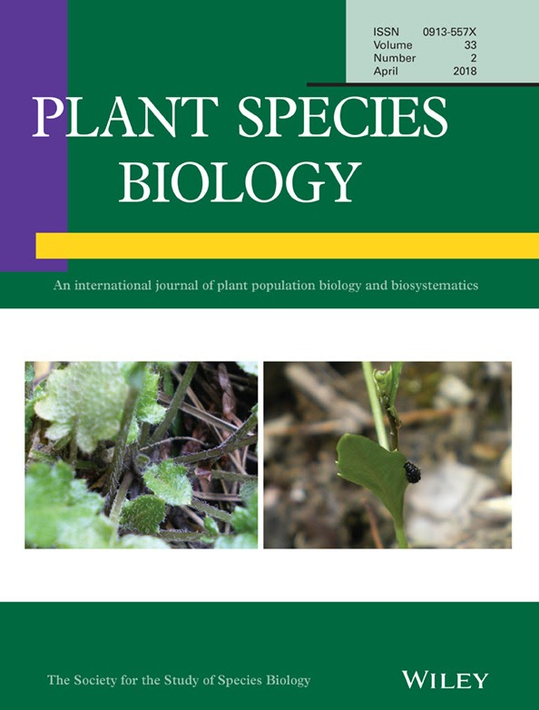

[[English]](index.html) [[日本語]](index_jp.html)  

### Current address
Department of Evolutionary Biology and Environmental Studies, University of Zurich  
Winterthurerstrasse 190, 8057 Zurich, Switzerland  
Tel: +41-44-635-4986; Office: Y13-J-68 ([Evolutionary and Ecological Genomics Group](https://www.ieu.uzh.ch/en/research/evolbiol/ecogenomics.html))  
E-mail: yasuhiro.sato"at"uzh.ch; yassato36c"at"outlook.com  
ORCID: [0000-0002-6466-723X](http://orcid.org/0000-0002-6466-723X)  
[Google scholar citations](http://scholar.google.co.jp/citations?user=HbrGYr8AAAAJ&hl=en);
[ResearchGate](https://www.researchgate.net/profile/Yasuhiro_Sato3); [Publons](https://publons.com/researcher/450213/yasuhiro-sato)  

### Research interests
1. Quantitative genetics of plant neighborhood effects (Sato et al. 2021 Heredity, G3, and ongoing)  
2. Evolutionary ecology of plant-herbivore interaction (Sato & Kudoh 2017 Am. Nat.; Sato, Ito & Kudoh 2017 Funct. Ecol.) **Keywords: Ecological genetics, Plant-insect interaction, Herbivory**  

### Education
- 2016　PhD in Science (Kyoto University, Japan) (supervisor: Prof. [Hiroshi Kudoh](http://www.ecology.kyoto-u.ac.jp/~kudoh/en/index.html)\)  
- 2013　MSc in Science (Kyoto University, Japan)  
- 2011　BSc in Agriculture (Kyoto University, Japan)  

### Research position
- 2021.04-present　Oberassistent (Senior Research Associate), Department of Evolutionary Biology and Environmental Studies, University of Zurich, Switzerland ([Evolutionary and Ecological Genomics Group](https://www.ieu.uzh.ch/en/research/evolbiol/ecogenomics.html)\)  
- 2017.10-present　Guest researcher of Research Institute for Food and Agriculture, Ryukoku University, Japan  
- 2017-2021　Fixed-term group leader of [Precursory Research for Embryonic Science and Technology](https://www.jst.go.jp/kisoken/presto/en/project/1112074/1112074_26.html) (PRESTO) project of Japan Science and Technology Agency (JST), Japan
- 2017-present　Affiliated member of [University Research Priority Program Global Change and Biodiversity](https://www.gcb.uzh.ch/en/aboutus/people.html) (URPP GCB), University of Zurich, Switzerland   
- 2016-2020　Affiliated scientist of Center for Ecological Research, Kyoto University
- 2016-2017　Independent Postdoctoral Fellowship of Japan Society for the Promotion of Science (JSPS), Japan (advisor: Assoc. Prof. [Atsushi J. Nagano](https://researchmap.jp/anagano/?lang=english)\)
- 2015-2016　Research Fellowship for PhD students (DC2), JSPS, Japan
- 2013-2014　Research assistant of Center for Ecological Research, Kyoto University, Japan

### Teaching experience
- 2021.09-2021.10　BIO373: Next Generation Sequencing for Evolutionary Functional Genomics, University of Zurich, Switzerland  
- 2019.04-2019.05　External Lecturer of Basic Genetics, Faculty of Agriculture, Ryukoku University, Japan
- 2018.07-2018.08　International Biology Undergraduate Summer School (BUSS) 2018, University of Zurich, Switzerland
- 2017.07-2017.08　BIO378: Research Practical in Evolutionary Biology and Systematics, University of Zurich, Switzerland
- 2013.09-2015.01　External Teaching Assistant of Basic Programming, Faculty of Science and Technology, Ryukoku University, Japan

### Publications  

#### Preprint   
1. Stockenhuber R, Akiyama A, Tissot N, Yamazaki M, Wyler M, Arongaus AB, Podolec R, **Sato Y**, Milosavljevic S, Widmer A, Ulm R, Shimizu KK. (2021) The _UV RESISTANCE LOCUS 8_-mediated UV-B response is required alongside _CRYPTOCHROME1_ for plant survival under sunlight in the field. **_bioRxiv_** https://doi.org/10.1101/2021.12.08.471623.

#### Peer-reviewed   
1. Takimoto H^\*^, **Sato Y**^\*^, Nagano AJ, Shimizu KK, Kanagawa A. (2021) Using a two-stage convolutional neural network to rapidly identify tiny herbivorous beetles in the field. **_Ecological Informatics_** 66:101466 ^\*^Equal contribution. <https://doi.org/10.1016/j.ecoinf.2021.101466>

1. **Sato Y**, Yamamoto E, Shimizu KK, Nagano AJ. (2021) Neighbor GWAS: incorporating neighbor genotypic identity into genome-wide association studies of field herbivory. **_Heredity_** 126(4):597–614. <https://doi.org/10.1038/s41437-020-00401-w> [[R package]](https://CRAN.R-project.org/package=rNeighborGWAS)  

1. **Sato Y**^\*^, Takeda K^\*^, Nagano AJ. (2021) Neighbor QTL: an interval mapping method for quantitative trait loci underlying plant neighborhood effects. **_G3; Genes|Genomes|Genetics_** 11(2):jkab017. ^\*^Equal contribution <https://doi.org/10.1093/g3journal/jkab017> [[R package]](https://CRAN.R-project.org/package=rNeighborQTL)  

1. Shimizu-Inatsugi R, Milosavljevic  S, Shimizu KK, Schaepman-Strub G, Tanoi K, **Sato Y.** (2021) Metal accumulation and its effect on leaf herbivory in an allopolyploid species _Arabidopsis kamchatica_ inherited from a diploid hyperaccumulator _A. halleri_. **_Plant Species Biology_** 36(2):208–217. <https://doi.org/10.1111/1442-1984.12304>

1. **Sato Y**, Tezuka A, Kashima M, Deguchi A, Shimizu-Inatsugi R, Yamazaki M, Shimizu KK, Nagano AJ. (2019) Transcriptional variation in glucosinolate biosynthetic genes and inducible responses to aphid herbivory on field-grown _Arabidopsis thaliana_. **_Frontiers in Genetics_** 10:787. <https://doi.org/10.3389/fgene.2019.00787>

1. **Sato Y**, Shimizu-Inatsugi R, Yamazaki M, Shimizu KK, Nagano AJ. (2019) Plant trichomes and a single gene _GLABRA1_ contribute to insect community composition on field-grown _Arabidopsis thaliana_. **_BMC Plant Biology_** 19:163. <https://doi.org/10.1186/s12870-019-1705-2>

1. **Sato Y.** (2018) Associational effects and the maintenance of polymorphism in plant defense against herbivores: review and evidence. **_Plant Species Biology_** 33(2):91-108. <https://doi.org/10.1111/1442-1984.12201> [[postprint]](https://repository.kulib.kyoto-u.ac.jp/dspace/handle/2433/234646?locale=en)

1. Nakadai R^\*^, Hashimoto K^\*^, Iwasaki T, **Sato Y.** (2018) Geographical co-occurrence of butterfly species: the importance of niche filtering by host plant species. **_Oecologia_** 186(4):995–1005. ^\*^Equal contribution <https://doi.org/10.1007/s00442-018-4062-1>

1. Sakata Y, **Sato Y.** (2017) Evolutionary ecology of plant defense: integrating different spatial scales within and among species (in Japanese). **_Japanese Journal of Ecology_** 67(3):287-306. <https://doi.org/10.18960/seitai.67.3_287>

1. **Sato Y**^\*^, Ito K^\*^, Kudoh H. (2017) Optimal foraging by herbivores maintains polymorphism in defence in a natural plant population. **_Functional Ecology_** 31(12):2233-2243. ^\*^Equal contribution <https://doi.org/10.1111/1365-2435.12937> [[postprint]](https://repository.kulib.kyoto-u.ac.jp/dspace/handle/2433/228143?locale=en)

1. **Sato Y**, Kudoh H. (2017) Herbivore-mediated interaction promotes the maintenance of trichome dimorphism through negative frequency-dependent selection. **_The American Naturalist_** 190(3):E67-E77. <https://doi.org/10.1086/692603> [[PDF]](https://repository.kulib.kyoto-u.ac.jp/dspace/handle/2433/226924?locale=en)

1. **Sato Y**, Kudoh H. (2017) Fine-scale frequency differentiation along a herbivory gradient in the trichome dimorphism of a wild _Arabidopsis_. **_Ecology and Evolution_** 7(7):2133-2141. <https://doi.org/10.1002/ece3.2830>

1. **Sato Y**, Kudoh H. (2016) Presence of substitute diets alters plant resistance to specialist and generalist herbivores: a meta-analysis. **_Ecosphere_** 7(11):e01446 <https://doi.org/10.1002/ecs2.1446>

1. **Sato Y**, Kudoh H. (2016) Associational effects against a leaf beetle mediate a minority advantage in defense and growth between hairy and glabrous plants. **_Evolutionary Ecology_** 30(1):137-154. <https://doi.org/10.1007/s10682-015-9809-0> [[postprint]](http://repository.kulib.kyoto-u.ac.jp/dspace/handle/2433/201635?locale=en)

1. **Sato Y**, Sato S. (2015) Spring temperature predicts the long-term molting phenology of two cicadas, _Cryptotympana facialis_ and _Graptopsaltria nigrofuscata_ (Hemiptera: Cicadidae). **_Annals of the Entomological Society of America_** 108(4):494-500. <https://doi.org/10.1093/aesa/sav036> [[postprint]](http://repository.kulib.kyoto-u.ac.jp/dspace/handle/2433/201636?locale=en)

1. **Sato Y**, Kudoh H. (2015) Tests of associational defence provided by hairy plants for glabrous plants of _Arabidopsis halleri_ subsp. _gemmifera_ against insect herbivores. **_Ecological Entomology_** 40(3):269-279. <https://doi.org/10.1111/een.12179> [[postprint]](http://repository.kulib.kyoto-u.ac.jp/dspace/handle/2433/201637?locale=en)

1. **Sato Y**, Kudoh H. (2014) Fine-scale genetic differentiation of a temperate herb: relevance of local environments and demographic change. **_AoB PLANTS_** 6:plu070. <https://doi.org/10.1093/aobpla/plu070>

1. **Sato Y**, Kawagoe T, Sawada Y, Hirai MY, Kudoh H. (2014) Frequency-dependent herbivory by a leaf beetle, _Phaedon brassicae_, on hairy and glabrous plants of _Arabidopsis halleri_ subsp. _gemmifera_. **_Evolutionary Ecology_** 28(3):545-559. <https://doi.org/10.1007/s10682-013-9686-3> [[postprint]](http://repository.kulib.kyoto-u.ac.jp/dspace/handle/2433/179616?locale=en)

1. **Sato Y**, Kudoh H. (2013) Relative strength of phenotypic selection on the height and number of flowering-stalks in the rosette annual _Cardamine hirsuta_ (Brassicaceae). **_Journal of Ecology and Environment_** 36(3):151-158. <https://doi.org/10.5141/ecoenv.2013.151>

1. **Sato Y**, Takakura KI, Nishida S, Nishida T. (2013) Dominant occurrence of cleistogamous flowers of _Lamium amplexicaule_ in relation to the nearby presence of an alien congener _L. purpureum_. **_ISRN Ecology_** Article ID:476862. <http://dx.doi.org/10.1155/2013/476862>

### Presentation
- [*List available here*](PresentationList_YasuhiroSato.html)

### Awards
1. Inoue Research Award for Young Scientists, Inoue Foundation for Science (2018)
1. Kataoka Award, The Society for the Study of Species Biology (2016)
1. [Ikushi Prize, Japan Society for the Promotion of Science](https://www.jsps.go.jp/english/e-ikushi-prize/awards_fy2015_01.html) (2016)

### Grants
1. JSPS Grants-in-Aid for Young Scientists (2020-2023, 3,200,000JPY as Principal Investigator)
1. JST Precursory Research for Embryonic Science and Technology (PRESTO) (2017-2021, 40,000,000JPY as Principal Investigator)
1. JSPS Research Fellowships for Young Scientists (PD) (2016-2017, 2,700,000JPY)
1. JSPS Research Fellowships for Young Scientists (DC2) (2015-2016,  1,200,000JPY)
1. JASSO Scholarship (2011-2015, 4,000,000JPY)  

### Panels and boards
- 2019.01-present　Editorial board member of the Society for the Study of Species Biology, Japan  
- 2020.04-2021.12　Reviewing editor of [Journal of Evolutionary Biology](https://onlinelibrary.wiley.com/page/journal/14209101/homepage/editorialboard.html)  
- 2020.12　Executive board member of the 52nd symposium of the Study of Species Biology, Japan  

### Affiliated academic societies
- 2010-present　Society for the Study of Species Biology  
- 2012-present　Ecological Society of Japan  
- 2017-present　Japanese Society of Plant Physiologists  
- 2017-permanent　American Society of Naturalists  
- 2020-present　European Society for Evolutionary Biology  

### Reviewer activity 
- _see [Publons](https://publons.com/researcher/450213/yasuhiro-sato) personal page._  
