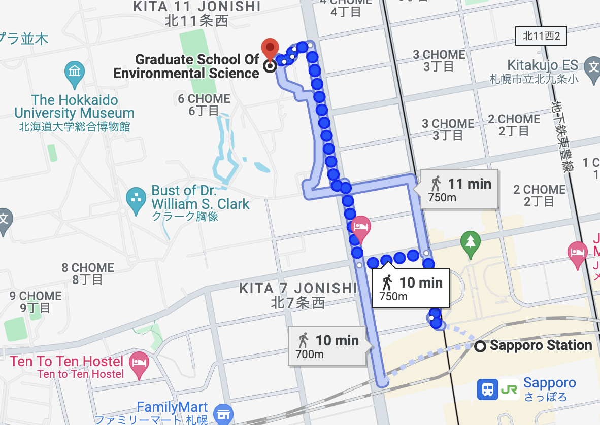

 

## About us

Welcome, we are studying plant ecological genetics with quantitative tools. Our lab is located in the Sapporo campus of Hokkaido University, Japan. Admission schedule for prospective graduate students is available on the official website of [Graduate School of Environmental Science](https://www.ees.hokudai.ac.jp/?lang=en). For scholarship information, please see the website of [Ministry of Education, Culture, Sports, Science and Technology (MEXT)](https://www.mext.go.jp/en/policy/education/highered/title02/detail02/sdetail02/1373897.htm). Currently we have no open call for postdoc positions, but you may consider [JSPS International Fellowships](https://www.jsps.go.jp/english/e-fellow/). If you wish to join our group, please send your CV and research interest to Yasuhiro Sato (yassato"at"ees.hokudai.ac.jp).  

 

## Address  

Faculty of Environmental Earth Science, Hokkaido University  
N10W5 Kita-ku, Sapporo 060-0810, Hokkaido, Japan  
Office: B-802 (Group of Ecological Genetics)  
Phone: +81 (0)11 706 4860  
E-mail: yassato"at"ees.hokudai.ac.jp; yassato36c"at"outlook.com  

{width="75%"}

