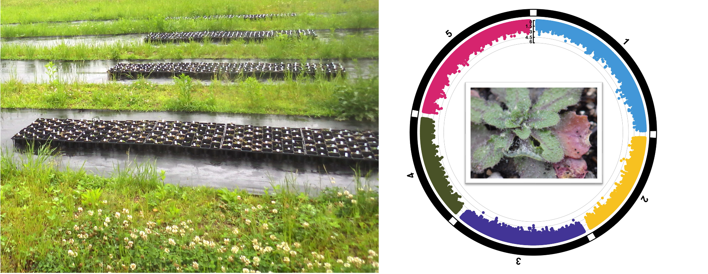
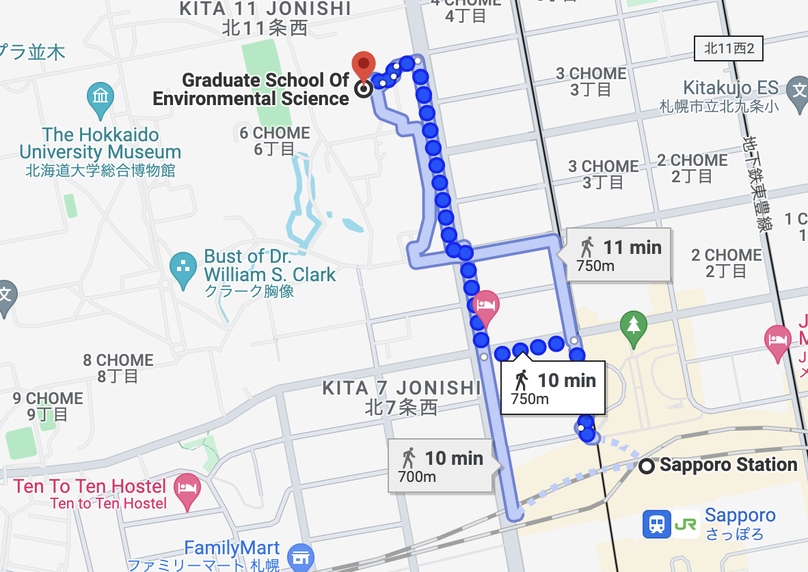

 

## ようこそ

こちらは佐藤研究室のホームページです。私たちは[北海道大学地球環境科学研究院](https://www.ees.hokudai.ac.jp/)で植物の生態遺伝学に関する研究を行っています。研究内容に興味を持たれた方は「連絡先」をご確認の上、佐藤までご連絡下さい。

---

### 配属を希望する学生さんへ
入試について：　当研究室は環境科学院の大学院を担当しています[1]。したがって、配属を希望する場合は大学院の入試を受ける必要があります。受け入れには教員の承諾が必要です。願書を提出する前に必ずご連絡下さい。なお、当学院の入試では外部英語試験（TOEICなど）のスコアが要求されます。締め切りに間に合うように前もって受験して下さい。

担当大学院について：　私たちの研究室は生物圏科学専攻の生態遺伝学コースに所属しています。同コース内には、群集生態学や進化発生学、ゲノム科学を専門とする研究室があります。扱う対象も昆虫から哺乳類、微生物まで様々です。もちろん国外からの留学生も所属しています。したがって、セミナーでは英語で発表資料を用意して頂きますので、入学前から心づもりして下さい。

研究テーマについて：　連絡の際には研究の興味と進路の希望を教えて下さい。何年かけて何をしたいのか一緒に考えましょう。途中で計画が変わったり気が変わったりするのはよくあることなので、話し合いながら進めていけば大丈夫です。博士課程まで進学する場合は学振DC[2]やEXEX博士人材[3]にも挑戦しましょう。獲得できれば生活費を受給しながら博士研究を進められます。当研究室プロジェクト付きRAも募集中です[4]。博士課程への進学を希望する場合は、これらの相談も合わせて受け付けます。

専門分野について：　生態学や進化生物学というと、野外で生き物を追いかけるイメージが強いと思います（私もそう思っていました）。しかし、いざこれらの分野を学び始めてみると、内容が意外と難しいと感じることが多々あります。これは複雑な現象を解きほぐすために数理モデルや統計学の手法が多用されるからです。当研究室では、生物の多様性を楽しむとともに、多様性から要点を抽出する力を養って欲しいと考えています。兼務先の理学部では講義も行っていますので、興味を持ったらシラバスで教員名を検索してみて下さい[5]。

---

### 博士号を取得した方々へ
プロジェクト付き博士研究員の募集は現在ありません。学振PDの受け入れはいつでも歓迎です[2]。独立のテーマでも共同研究に近い形でもどちらでも受け入れます。ただ、小規模なグループで運営していますので、設備面での実現可能性については要相談です。学内には共通機器やスペースもありますので、早めにご相談下さい。また、学振の他にも本学独自に特別助教の制度があります[6]。そちらも興味があればご確認下さい。

---

### 一般の方々へ
当研究室では、植物の遺伝的多様性を活かして栽培を効率化するプロジェクトを進めています[4]。主に非商用植物を対象とした基礎研究を手掛けていますが、中には作物に転用可能な技術もあります。共同研究をお考えの場合は佐藤までご連絡下さい。経歴と技能は[researchmap](https://researchmap.jp/yassatojpn/?lang=japanese)や[LinkedIn](https://www.linkedin.com/in/yasuhiro-sato-71ba3b233/)で確認できます。

---

### 関連リンク

1. [北海道大学大学院環境科学院/地球環境科学研究院](https://www.ees.hokudai.ac.jp/)  
担当大学院の公式ホームページです。大学院入試の情報もこちらから得られます。配属を希望する場合は事前に相談して下さい。

2. [日本学術振興会　特別研究員](https://www.jsps.go.jp/j-pd/)  
学振DCやPDの情報はこちらから得られます。受け入れ希望の方は事前にご相談下さい。  

3. [北海道大学　EXEX博士人材フェローシップポータルサイト](https://sites.google.com/eis.hokudai.ac.jp/exexphd-fellow/)  
北海道大学に在学中の博士学生を対象としたフェローシップです。博士課程での配属を考える方は入試と合わせてご検討下さい。  

4. [科学技術振興機構　創発的研究支援事業（JST創発）](https://www.jst.go.jp/souhatsu/)  
現在採択中の研究費です。一緒に研究に取り組む大学院生RAを募集しています（例年2月頃募集締切）。枠に限りがありますので、入試と合わせて事前にご相談下さい。

5. [北海道大学理学部　生物科学科（生物学専修）](https://www2.sci.hokudai.ac.jp/dept/bio/teacher/sato-yasuhiro)  
兼務先学部の教員紹介ページです。講義を聴いて興味が湧いたら気軽にご連絡下さい。

6. [北海道大学総合イノベーション創発機構　研究人材育成推進室](https://l-station.cris.hokudai.ac.jp/)  
こちらから本学アンビシャス助教の公募情報が確認できます。

 

## 研究内容

{width="80%"}

生物情報学の技術を使って植物を取りまく生態現象を解きほぐす研究を行っています。野外における生物の環境応答や生物間の相互作用は量的な変異をともなった複雑な形質です。取り扱いのむずかしい生態現象にオミクス科学を応用することで、現象の背後にある遺伝的基盤を定量的に理解することを目指しています。  

最近は特に以下の研究テーマに興味をもって取り組んでいます。

1. 植物の個体間相互作用に関する量的遺伝学（Sato et al. 2024 Nature Communications他；プレスリリース記事は[こちら](<https://www.hokudai.ac.jp/news/pdf/241008_pr.pdf>)から）
1. 植物防御の進化生態学（Sato & Kudoh 2017 American Naturalist他）
1. 生態学・進化生物学・遺伝学におけるデータ解析（Sato et al. 2023 Evolution; Sato et al. 2017 Functional Ecology他）  

その他の興味としては以下の書籍が参考になります。日本語で読めるので、ぜひお手に取って下さい。  

](./images/sssb6210-7.jpg){width="30%"}  
  
 

## 業績

＊業績一覧は[researchmap](https://researchmap.jp/yassatojpn/?lang=japanese)で更新しています。以下は研究内容に関連した主な論文です。  

1. **Sato Y**, Shimizu-Inatsugi R, Takeda K, Schmid B, Nagano AJ, Shimizu KK. (2024) Reducing herbivory in mixed planting by genomic prediction of neighbor effects in the field. **_Nature Communications_** 15:8467. <https://doi.org/10.1038/s41467-024-52374-7> 

1. **Sato Y**, Takahashi Y, Xu C, Shimizu KK. (2023) Detecting frequency-dependent selection through the effects of genotype similarity on fitness components. **_Evolution_** 77:1145–1157. <https://doi.org/10.1093/evolut/qpad028> 

1. **Sato Y**, Yamamoto E, Shimizu KK, Nagano AJ. (2021) Neighbor GWAS: incorporating neighbor genotypic identity into genome-wide association studies of field herbivory. **_Heredity_** 126(4):597–614. <https://doi.org/10.1038/s41437-020-00401-w>   

1. **Sato Y**, Ito K, Kudoh H. (2017) Optimal foraging by herbivores maintains polymorphism in defence in a natural plant population. **_Functional Ecology_** 31(12):2233-2243. <https://doi.org/10.1111/1365-2435.12937>  

1. **Sato Y**, Kudoh H. (2017) Herbivore-mediated interaction promotes the maintenance of trichome dimorphism through negative frequency-dependent selection. **_The American Naturalist_** 190(3):E67-E77. <https://doi.org/10.1086/692603>  
  
 

## 構成員

### 研究室主宰者

{width="25%"}

佐藤　安弘　（サトウ　ヤスヒロ）  
2016年に京都大学にて博士（理学）を取得。龍谷大学にて日本学術振興会特別研究員および科学技術振興機構さきがけ研究者、スイス・チューリッヒ大学にて助手を経験した後、2024年より北海道大学テニュアトラック助教。専門は植物を中心とした生態遺伝学。  

 

### 博士研究員
- 石黒　智基（学術研究員；[内海研究室](https://evo-comm-ecology.com/)と兼任）

 

### 学生
- AKRAM, Iqra（博士後期課程；北海道大学EXEXフェロー受給生）

 

### 補佐員
- 川越　未歩（事務補助員；[内海研究室](https://evo-comm-ecology.com/)と兼任）
  
 

## 連絡先
北海道大学大学院　地球環境科学研究院　環境生物科学部門　生態遺伝学分野  
〒060-0810　北海道札幌市北区北10条西5丁目　地球環境科学研究院B棟802室  
E-mail: yassato(あっと)ees.hokudai.ac.jp; yassato36c(あっと)outlook.com  
研究者情報: ORCID:[0000-0002-6466-723X](http://orcid.org/0000-0002-6466-723X); [researchmap](https://researchmap.jp/yassatojpn/?lang=japanese); [Google scholar citations](https://scholar.google.co.jp/citations?hl=ja&user=HbrGYr8AAAAJ&view_op=list_works&sortby=pubdate); [ResearcherID](https://www.webofscience.com/wos/author/rid/N-7939-2013)  

{width="50%"}

 

