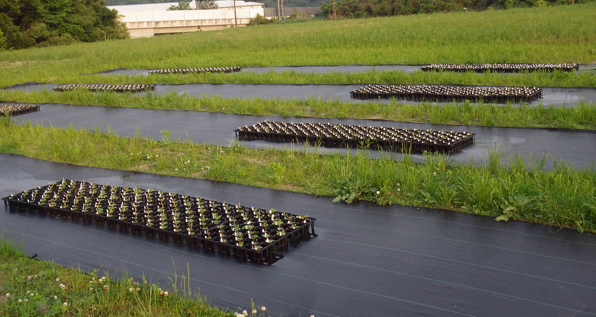

 

## **Recent topics**  
We are interested in how genetic variation shapes, and is shaped by, biotic interactions. To analyze quantitative genetic variation in complex ecological traits, our research employs cutting-edge tools of computational biology and functional genomics. Currently, we are working on plants and insects, but other projects involving biotic interactions are also welcome.  
**Keywords: Plant Ecology, Quantitative Genetics, Biotic Interaction**  

 

### **1. Quantitative Genetics of Plant-Plant Interaction**  
Plants cannot escape from neighboring individuals in the field, making plant-plant interactions unavoidable in a local space. Despite the prevalence of neighboring plant-plant interactions, these interactions are not always attributable to a single trait or gene. To dissect the genetic architecture of intraspecific plant-plant interactions, we developed new methods named "Neighbor GWAS" (Sato et al. 2021 Heredity) and "Neighbor QTL" (Sato et al. 2021 G3). These methods are being applied to the analysis of insect herbivory and communities on *Arabidopsis thaliana* accessions (Sato et al. 2024 Nature Communications) in addition to other quantitative traits in crops, trees, etc... We are also seeking the potential application of intraspecific plant-plant interactions to improve plant resistance and yield by mixed planting.  

{width="50%"}

 

### **2. Evolutionary Ecology of Plant Defense Against Herbivores**  
Plants develop various defense traits against herbivores. Such anti-herbivore defense traits exhibit polymorphisms within a natural plant population, which leads us to ask how these polymorphisms can be maintained in nature. By focusing on neighboring plants, we found that hairy plants were less damaged by a leaf beetle when surrounded by glabrous plants in the wild herb *Arabidopsis halleri*. Such neighbor effects further exerted negative frequency-dependent selection on *GLABRA1*-based trichome dimorphism (Sato & Kudoh 2017 American Naturalist; Sato et al. 2017 Functional Ecology). These findings highlight the importance of neighbor effects in the maintenance of genetic variation in anti-herbivore defense traits (reviewed in Sato 2018 Plant Species Biology).  

](./images/psbi12186-toc-0001-m_coverphoto.jpg){width="30%"}

 

### **3. Data Analysis in Ecology, Evolution, and Genetics**  
Our research often employs statistical tools to untangle complex ecological interactions. This experience enables us to not only develop new methods (Sato et al. 2023 Evolution) but also collaborate with other research areas (e.g., Takimoto & Sato et al. 2021 Ecological Informatics). Data from plant ecology and genomics are especially welcome for potential collaboration.  
  
 

